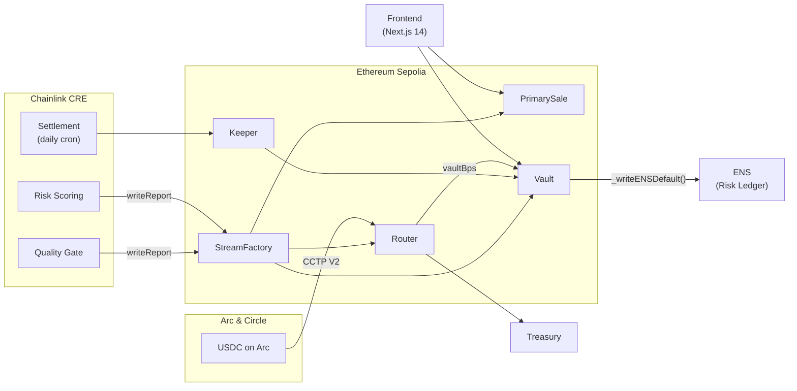
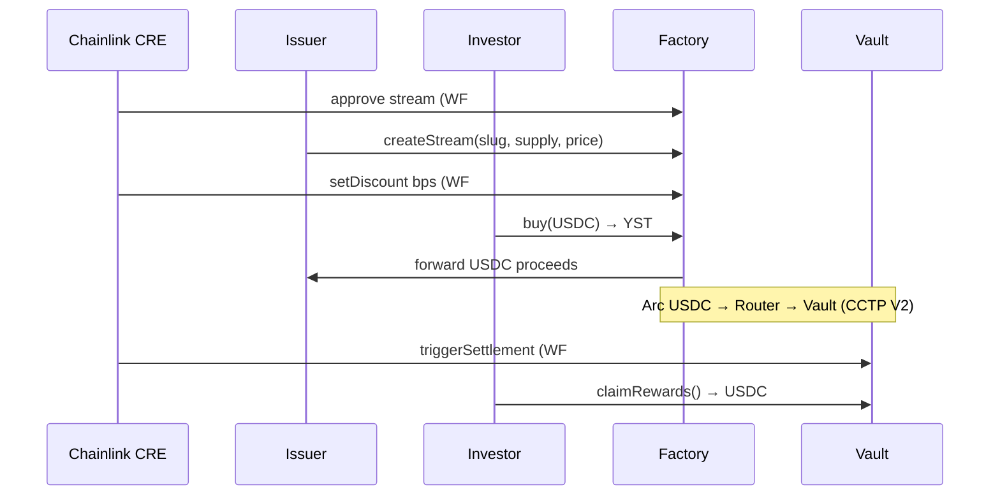

# YIELD STREAM MARKETPLACE (YSM) — ETHGLOBAL CANNES 2026

Yield Stream Marketplace (YSM) is a decentralized protocol that tokenizes protocol revenue streams into 1:1 USDC-backed **Yield Stream Tokens (YST)**. By integrating **Arc L1 (Circle)**, **Chainlink CRE**, and **ENS**, YSM creates a transparent, automated, and institutional-grade on-chain capital marketplace.

---

## Hackathon Tracks

### 1. Arc (Circle)

- **Programmable USDC Settlement**: `Router.sol` is a programmable settlement engine. It handles multi-step fee distribution, splitting revenue between investor `Vault` contracts and a protocol `Treasury` with basis-point precision (`BPS_DENOMINATOR = 10,000`).
- **Chain-Abstracted Liquidity Hub**: YSM treats Arc as its primary **Economic OS**. Using the **Circle Bridge Kit** (`@circle-fin/bridge-kit`) and **Circle Forwarder**, USDC flows effortlessly from Arc Testnet to Ethereum Sepolia via CCTP V2.
  - *See:* `smart-contracts/scripts/bridge-arc-to-sepolia.ts` & `Router.sol:receiveFromArc`
  - *Also see:* `frontend/ARC_BRIDGE_FLOW.md` for the full end-to-end walkthrough

--

### 2. ENS — Identity, Reputation & Subname Registry

- **Identity Gate** — `createStreamDirect()` requires a primary ENS name via Reverse Registrar. No ENS = no stream.
- **Automatic Subname Minting** — On stream deployment, `Factory` mints `{protocolSlug}.ysm.eth` pointing to the Vault via `NameWrapper.setSubnodeRecord()`. Factory holds the ERC-1155 NFT — the issuer cannot modify it.
- **Decentralized Risk Ledger** — After 30 days without fees, or if the stream ends without the expected yield being delivered, `slashCollateral()` flags the protocol as defaulted by writing `ysm.status = DEFAULTED` to the subdomain's ENS text records. Written by the contract, not the issuer — trustless and visible to any ENS-compatible wallet.

> **Demo note:** For this demo, the ENS name ownership check (verifying `msg.sender` owns `{protocolSlug}.eth`) is not enforced, allowing us to simulate campaigns for real protocols like Quickswap. In production, only the wallet holding `quickswap.eth` would be allowed to create a Quickswap stream — ENS proves identity, Chainlink CRE proves revenue.

--

### 3. Chainlink

- **Chainlink CRE (Compute Runtime Engine)** — Three production workflows in `chainlink-CRE/my-workflow/main.ts`:
  - **Workflow #1 — Risk Scoring** (HTTP trigger): Fetches real-time ETH/USD price from the Chainlink Sepolia feed (`0x694AA1769357215DE4FAC081bf1f309aDC325306`) with a Binance API fallback, fetches protocol rScore from our **Cloudflare Worker** proxy (DeFiLlama data), and computes a `discountBps` value. Writes the report on-chain via `EVMClient.writeReport` → `StreamFactory.onReport`.
  - **Workflow #2 — Quality Gate** (HTTP trigger): Evaluates `avg30 ≥ $1000`, `rScore ≥ 0.5`, and `daysOfData ≥ 90` against live DeFiLlama data. Writes an approval boolean on-chain to gate new stream creation.
  - **Workflow #3 — Auto-Settlement** (Cron: `0 0 * * `* daily): Triggers `Keeper.sol` on-chain to execute batch yield distribution.
  - *See:* `chainlink-CRE/my-workflow/main.ts`, `chainlink-CRE/my-workflow/workflow.yaml`

---

## System Architecture

### Global Ecosystem




### Yield Streaming Lifecycle (IPO to Settlement)




---

## Smart Contract Registry (Sepolia)


| Contract                        | Role                                                  | Address                                                                                                                         |
| ------------------------------- | ----------------------------------------------------- | ------------------------------------------------------------------------------------------------------------------------------- |
| **StreamFactory**               | Registry, ENS subdomain creation, CRE report receiver | `[0x902514A32F0882b5F38F8C6583F5c13E52717d4d](https://sepolia.etherscan.io/address/0x902514A32F0882b5F38F8C6583F5c13E52717d4d)` |
| **PrimarySale**                 | IPO / funding entry point                             | `[0x5161d70daCBfFc651FAd24aC63200Ac72c4A4aF3](https://sepolia.etherscan.io/address/0x5161d70daCBfFc651FAd24aC63200Ac72c4A4aF3)` |
| **YSM Router**                  | Fee splitter & CCTP bridge receiver                   | `[0x02E75407376e5FBEd0e507E8265d92CeE9279fDC](https://sepolia.etherscan.io/address/0x02E75407376e5FBEd0e507E8265d92CeE9279fDC)` |
| **Arc Stream Router**           | Latest Arc → Sepolia CCTP target                      | `[0xD45A28c968A6C3311e109e903a573671193B1e2d](https://sepolia.etherscan.io/address/0xD45A28c968A6C3311e109e903a573671193B1e2d)` |
| **Keeper / MasterSettler**      | Chainlink Automation + CRE Settlement hub             | `[0xcd01f4a7cadceAA89B71fbf77aD80dDD3CfE2fC4](https://sepolia.etherscan.io/address/0xcd01f4a7cadceAA89B71fbf77aD80dDD3CfE2fC4)` |
| **Vault (Demo)**                | Active yield vault for the demo stream                | `[0xdBcbf598eaC150d62bA0DB1b8E482f1351380bC8](https://sepolia.etherscan.io/address/0xdBcbf598eaC150d62bA0DB1b8E482f1351380bC8)` |
| **YST Token**                   | Yield-bearing ERC20 asset                             | `[0x343f28CEA446Cef6e8A380bFe11BcBf95f115370](https://sepolia.etherscan.io/address/0x343f28CEA446Cef6e8A380bFe11BcBf95f115370)` |
| **YST Splitter**                | Revenue splitter (vault / treasury BPS)               | `[0xaCD8f042eE1E29580A84e213760D144957eec148](https://sepolia.etherscan.io/address/0xaCD8f042eE1E29580A84e213760D144957eec148)` |
| **PriceFloorHook**              | Uniswap v4 hook (experimental)                        | `[0x718a99478f65Bc0d67499641D8888E4B02DD81DC](https://sepolia.etherscan.io/address/0x718a99478f65Bc0d67499641D8888E4B02DD81DC)` |
| **USDC (Sepolia)**              | Circle test USDC                                      | `[0x1c7D4B196Cb0C7B01d743Fbc6116a902379C7238](https://sepolia.etherscan.io/address/0x1c7D4B196Cb0C7B01d743Fbc6116a902379C7238)` |
| **MockQuickswap (Base sim)**    | Revenue mock — Base fees                              | `[0x646f3ba4fe570D52e0C80D2A7Bf2131A990e4d95](https://sepolia.etherscan.io/address/0x646f3ba4fe570D52e0C80D2A7Bf2131A990e4d95)` |
| **MockQuickswap (Polygon sim)** | Revenue mock — Polygon fees                           | `[0x72dbd97F1B8dAe5D4F31F8cEDe65895208E51f9c](https://sepolia.etherscan.io/address/0x72dbd97F1B8dAe5D4F31F8cEDe65895208E51f9c)` |


### Arc Testnet Addresses


| Contract                    | Address                                      |
| --------------------------- | -------------------------------------------- |
| **USDC (native, 18 dec)**   | `0x3600000000000000000000000000000000000000` |
| **TokenMessengerV2 (CCTP)** | `0x8FE6B999Dc680CcFDD5Bf7EB0974218be2542DAA` |


---

## Technical Deep Dive

### YST Yield Math — Synthetix-Style Staking

`Vault.sol` uses a **checkpoint-based reward accumulator** (adapted from Synthetix).

- Rewards are never pushed to users — they accumulate globally in a `rewardPerToken` counter.
- Whenever a YST balance changes (transfer, mint, or burn), both sender and receiver are checkpointed.
- **Formula:** `earned = balance × (rewardPerToken − userRewardPerTokenPaid)`

### Dynamic Discount Model (Chainlink CRE Workflow #1)

The CRE Risk Scoring workflow computes a dynamic discount rate $\mathcal{D}$ for each Yield Stream, bounding the face value vs. the purchase price of the RWA.

$$\mathcal{D} = 0.25(\sigma \times 3.46) + 0.35(1 - R) + 0.40M$$


| Symbol   | Meaning                                               | Source                               |
| -------- | ----------------------------------------------------- | ------------------------------------ |
| $\sigma$ | Monthly asset volatility (benchmark: `0.165`)         | Fixed constant                       |
| $R$      | Protocol reliability score $[0, 1]$                   | Cloudflare Worker → DeFiLlama        |
| $M$      | 30-day market drawdown: $1 - P_\text{now} / P_{-30d}$ | Binance API / Chainlink ETH/USD feed |


> The final discount is clamped to **[10%, 50%]** and expressed in basis points for on-chain encoding.

### Quality Gate Model (Chainlink CRE Workflow #2)

A protocol stream is approved for creation only if **all three** conditions are met via the DeFiLlama proxy:


| Criterion                    | Threshold |
| ---------------------------- | --------- |
| Average daily fees (30d)     | ≥ $1,000  |
| Reliability score (`rScore`) | ≥ 0.5     |
| Days of on-chain fee history | ≥ 90 days |


### Cloudflare Worker — DeFiLlama Proxy

Deployed at `ysm-defilama-proxy.ysm-market-proxy.workers.dev/fees/{slug}`.

- Proxies `https://api.llama.fi/summary/fees/{slug}` with a 1-hour Cloudflare edge cache.
- Computes and returns: `rScore`, `avg30`, `daysOfData`, `activeDays`, `yesterdayFees`.
- Used by both CRE Workflows #1 and #2, and by the frontend's `useDemoProtocolRevenueFeed` hook.

### Arc → Sepolia CCTP Bridge Flow

```
Arc Testnet wallet (USDC native, 18 dec)
  └─ bridge-arc-to-sepolia.ts  (Circle Bridge Kit + Circle Forwarder)
       ▼ CCTP V2 mint (~1–3 min, ~7% Circle fee)
  YSM Router (Sepolia)
       └─ flushBalance()  ← "Flush Arc fees" button in the UI
            ├─ vaultBps % → Vault.depositFees()   (YST holders earn)
            └─ remainder  → Treasury
```

---

## Setup & Development

### Prerequisites

- Node.js ≥ 18
- `bun` (for CRE workflow: `npm install -g bun`)

### 1. Frontend

```bash
cd frontend
npm install
cp .env.example .env   # or fill in manually
npm run dev            # → http://localhost:3000
```

**Required env vars (`frontend/.env`):**

```env
NEXT_PUBLIC_SEPOLIA_RPC_URL=https://eth-sepolia.g.alchemy.com/v2/<KEY>
NEXT_PUBLIC_ETHERSCAN_API_KEY=<KEY>
PRIVATE_KEY=0x<YOUR_KEY>
BRIDGE_AMOUNT_USDC=5.00
```

### 2. Smart Contracts

```bash
cd smart-contracts
npm install
```

**Required env vars (`smart-contracts/.env`):**

```env
PRIVATE_KEY=0x<YOUR_KEY>
NEXT_PUBLIC_SEPOLIA_RPC_URL=https://eth-sepolia.g.alchemy.com/v2/<KEY>
BRIDGE_AMOUNT_USDC=5.00
```

**Useful scripts:**

```bash
# Deploy the full stack
npx hardhat run scripts/deploy-factory.ts --network sepolia
npx hardhat run scripts/deploy-primary-sale.ts --network sepolia
npx hardhat run scripts/deploy-keeper.ts --network sepolia
npx hardhat run scripts/deploy-mocks.ts --network sepolia

# Bridge Arc USDC to Sepolia
npx ts-node scripts/bridge-arc-to-sepolia.ts

# Run the demo flow end-to-end
npx ts-node scripts/demo-flow.ts
```

### 3. Chainlink CRE Workflow

```bash
cd chainlink-CRE/my-workflow
bun install

# Deploy to staging
cre deploy --target staging-settings

# Deploy to production
cre deploy --target production-settings
```

### 4. Cloudflare Worker (DeFiLlama Proxy)

```bash
cd chainlink-CRE/cloudflare-worker
npm install
npx wrangler deploy   # requires Cloudflare account
```

---

*Built for ETHGlobal Cannes 2026.*
