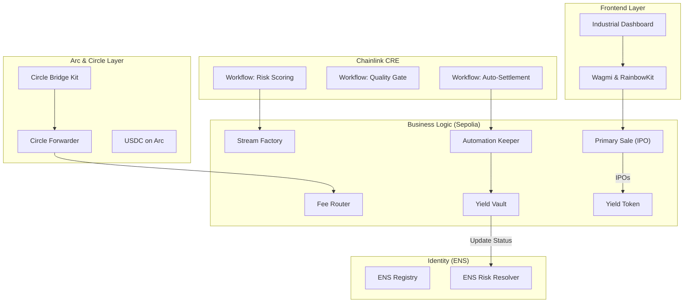
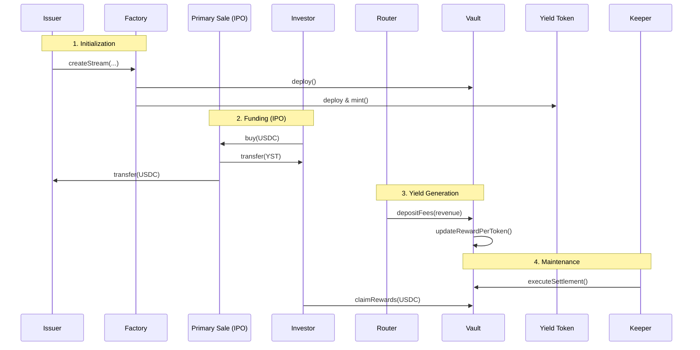

# YIELD STREAM MARKETPLACE (YSM) - ETHGLOBAL CANNES 2026

**YSM lets DeFi protocols sell their future fee revenue against immediate liquidity**

Yield Stream Marketplace (YSM) is a decentralized protocol designed to tokenize revenue streams into 1:1 USDC-backed Yield Stream Tokens (YST). By integrating **Arc L1 (Circle)**, **Chainlink CRE (Orchestration)**, and **ENS (Identity & Reputation)**, YSM creates a transparent, automated, and secure ecosystem for on-chain lending and capital markets.

---

## 🏆 Hackathon Tracks & Technical Merit

### 1. Arc (Circle) 
*   **Advanced Stablecoin Logic (Programmable USDC)**: Our `Router.sol` acts as a programmable settlement engine. It handles multi-step fee distribution, splitting revenue between investor `Vaults` and the protocol `Treasury` with basis-point precision (`BPS_DENOMINATOR = 10,000`).
*   **Chain Abstracted USDC Apps (Liquidity Hub)**: YSM treats Arc as the primary **Economic OS**. Using the **Circle Bridge Kit** and **Circle Forwarder**, we move capital effortlessly between Arc Testnet and Ethereum Sepolia.
    *   *Reference*: `smart-contracts/scripts/bridge-arc-to-sepolia.ts` & `Router.sol:receiveFromArc`.

### 2. ENS 
*   **Most Creative Use of ENS (Reputation & Credit)**: We use ENS as a **Decentralized Risk Ledger**. 
    *   Every Yield Stream is mapped to an ENS subnode (e.g., `issuer.ysm.eth`).
    *   **On-Chain Status Updates**: Upon a technical default or missed payment, the `Vault.sol` contract programmatically updates the ENS `ysm.status` text record to `DEFAULTED` via the `IENSResolver`.
    *   *Reference*: `Vault.sol:_writeENSDefault`.

### 3. Chainlink 
*   **Best Workflow with Chainlink CRE (Orchestration)**:
    *   **Workflow #1 (Risk Scoring)**: Fetches real-time market data (Binance/Chainlink) to compute dynamic discount rates for RWA streams.
    *   **Workflow #2 (Quality Gate)**: Automated audit of protocol history (DeFiLlama) before authorizing a stream.
    *   **Workflow #3 (Settlement)**: Time-based Cron triggers that orchestrate daily yield distribution via our `Keeper.sol` and `creForwarder`.
    *   *Reference*: `chainlink-CRE/my-workflow/main.ts` & `Keeper.sol:onReport`.

---

## 🏗 System Architecture

### 1. The Global Ecosystem

### 2. Yield Streaming Lifecycle (IPO to Settlement)

---

## 🛠 Smart Contract Registry (Sepolia)

| Contract | Role | Address |
| :--- | :--- | :--- |
| **StreamFactory** | Registry & Deployment | `0x902514A32F0882b5F38F8C6583F5c13E52717d4d` |
| **PrimarySale** | IPO / Funding Entry | `0x5161d70daCBfFc651FAd24aC63200Ac72c4A4aF3` |
| **YSM Router** | Fee Splitter & Bridge Receiver | `0x02E75407376e5FBEd0e507E8265d92CeE9279fDC` |
| **Keeper/Settler** | Chainlink Automation & CRE Hub | `0xcd01f4a7cadceAA89B71fbf77aD80dDD3CfE2fC4` |
| **Vault (Demo)** | Current Active Yield Vault | `0xdBcbf598eaC150d62bA0DB1b8E482f1351380bC8` |
| **YST Token** | Yield-Bearing ERC20 Asset | `0x343f28CEA446Cef6e8A380bFe11BcBf95f115370` |
| **PriceFloorHook** | Uniswap v4 Hook (Experimental) | `0x718a99478f65Bc0d67499641D8888E4B02DD81DC` |

---

## 🔬 Technical Deep Dive

### The YST Yield Math
The system uses a modified **Synthetix-style Staking** algorithm. Rewards are not pushed to users; they are accumulated globally.
*   **Checkpointing**: Whenever a YST balance changes (via transfer, mint, or burn), the `Vault.sol` contract checkpoints the rewards for both the sender and receiver.
*   **Formula**: `earned = balance * (rewardPerToken - userRewardPerTokenPaid)`.

### 📊 Mathematical Model: Dynamic Discounting
To ensure institutional-grade risk management, our **Chainlink CRE Workflow** calculates a dynamic discount rate ($\mathcal{D}$) for each Yield Stream. This rate determines the "Face Value" vs. the "Purchase Price" of the RWA.

The formula is a weighted aggregation of three risk vectors:

$$
\mathcal{D} = 0.25(\sigma \times 3.46) + 0.35(1 - R) + 0.40(M)
$$

**Risk Components:**
- **Volatility Risk ($25\%$)**: Based on monthly asset volatility ($\sigma$).
- **Reliability Risk ($35\%$)**: Based on protocol rScore ($R$).
- **Market Risk ($40\%$)**: Based on 30-day drawdown ($M$).

**Parameters:**
- **$\sigma$ (Sigma)**: Monthly asset volatility (benchmark set at 0.165).
- **$R$ (rScore)**: Reliability score ($0 \dots 1$) fetched via DeFiLlama proxy.
- **$M$ (Market Risk)**: 30-day drawdown exposure. $M = 1 - (Price_{now} / Price_{30d})$.

*The final discount is bounded between **10%** and **50%**.*

### RWA Simulation (Mocks)
To demonstrate cross-chain revenue in a testnet environment, we use a suite of **MockProtocols**:
- **MockArcProtocol**: Simulates yield natively on Arc.
- **MockQuickswapBase / Polygon**: Simulates revenue from other EVM L2s, which is then consolidated in our liquidity hub.

---

## 📦 Setup & Deployment

1.  **Install Dependencies**: `npm install` (Frontend) and `npm install` (Smart Contracts).
2.  **Environment Configuration**: Create `.env` files in both directories following `.env.example`.
3.  **Run Development Server**: `npm run dev`.

---
*Built for ETHGlobal Cannes 2026.*
