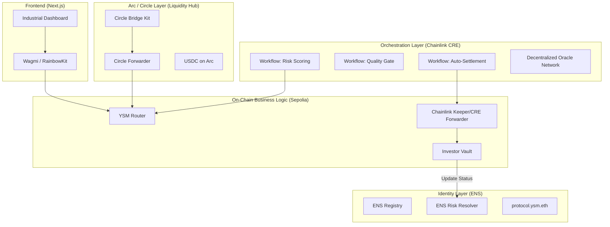
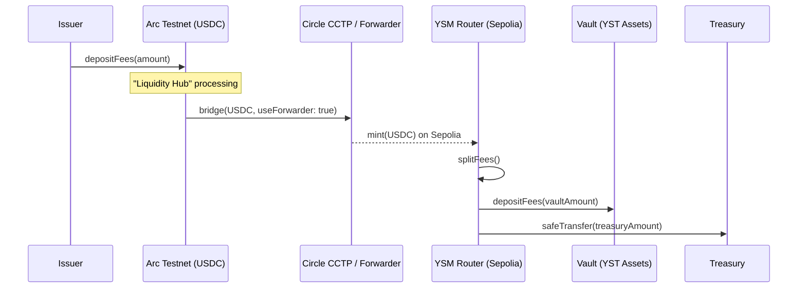
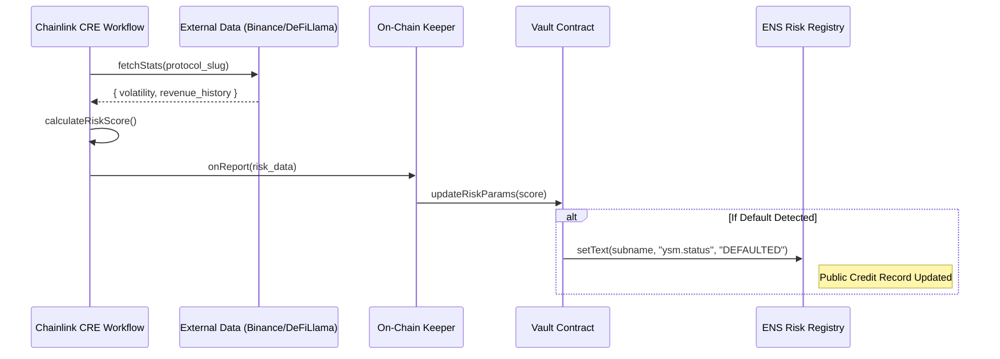

# YIELD STREAM MARKETPLACE (YSM) - ETHGLOBAL CANNES 2026

**The Programmable Economic OS for Real-World Asset (RWA) Yield.**

Yield Stream Marketplace (YSM) is a decentralized platform that tokenizes revenue streams into 1:1 USDC-backed Yield Stream Tokens (YST). By leveraging the **Arc L1 (Circle)** for liquidity, **Chainlink CRE** for institutional-grade orchestration, and **ENS** for decentralized identity and risk management, YSM bridges the gap between traditional finance and on-chain liquidity.

---

## 🚀 Hackathon Tracks Overview

We are submitting for the following bounties:

### 1. Arc (Circle) - $6,000
*   **Best Smart Contracts on Arc with Advanced Stablecoin Logic**: Our `Router.sol` implements complex, multi-step settlement mechanisms. It programmatically splits incoming revenue streams between investor vaults and protocol treasury using advanced programmable logic in USDC.
*   **Best Chain Abstracted USDC Apps**: YSM treats Arc as a central **Liquidity Hub**. Using the **Circle Bridge Kit** and **Circle Forwarder**, we move capital across chains (Arc Testnet ↔ Ethereum Sepolia) through a single interface, abstracting cross-chain complexity for the user.

### 2. ENS - $5,000
*   **Most Creative Use of ENS**: We use ENS as a **Decentralized Credit Bureau**. Every Yield Stream is linked to an ENS subname (e.g., `protocol.ysm.eth`). If a stream defaults, our smart contracts programmatically update the ENS `ysm.status` text record to `DEFAULTED`, providing a verifiable, on-chain reputation layer that works across the entire ecosystem.

### 3. Chainlink - $7,000
*   **Best Workflow with Chainlink CRE**: We built a sophisticated **Orchestration Layer** using the CRE SDK.
    *   **Workflow #1 (Risk Scoring)**: Connects to Binance & DeFiLlama APIs to calculate real-time discount rates based on volatility.
    *   **Workflow #2 (Quality Gate)**: Automated audit of protocol revenue/history before allowing stream creation.
    *   **Workflow #3 (Auto-Settlement)**: Time-based Cron triggers that orchestrate daily yield distribution via our on-chain Keeper.

---

## 🏗 Technical Architecture

### System Overview


### Advanced Stablecoin Logic (Arc/Circle)


### RWA Risk Monitoring (CRE + ENS)


---

## 🛠 Smart Contracts & Technical Detail

### Contract Registry (Cannes Demo Deployment)
| Contract | Chain | Address |
| :--- | :--- | :--- |
| **StreamFactory** | Sepolia | `0a52b6D02f55ae19Ff3973559Bf2b8129EfcC73B` |
| **MasterSettler/Keeper** | Sepolia | `2F3dd4718A8e8f709d82aC37840565ABCEddA780` |
| **YSM Router** | Sepolia | `0x02E75407376e5FBEd0e507E8265d92CeE9279fDC` |
| **USDC Mock** | Sepolia | `0x1c7D4B196Cb02324016fd059a14597Ba5ebaC961` |

### Environment Variables
```bash
# Frontend
NEXT_PUBLIC_FACTORY_ADDRESS=0x0a52b6D02f55ae19Ff3973559Bf2b8129EfcC73B
NEXT_PUBLIC_ROUTER_ADDRESS=0x02E75407376e5FBEd0e507E8265d92CeE9279fDC
NEXT_PUBLIC_USDC_ADDRESS=0x1c7D4B196Cb02324016fd059a14597Ba5ebaC961

# Bridge / Arc
PRIVATE_KEY=your_wallet_private_key
BRIDGE_AMOUNT_USDC=10.00
```

---

## 🎥 Demo
- **Video Link**: [YouTube / Loom Link]
- **Platform URL**: [Vercel Deployment]

---
*Built with at ETHGlobal Cannes 2026.*
